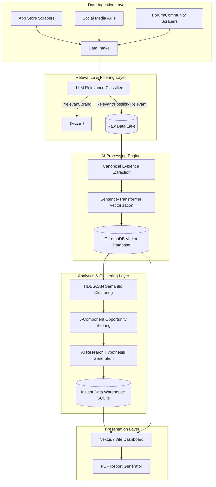

# AI-Powered Discovery Engine: System Architecture

## 1. Overview
The architecture is designed to continuously ingest unstructured user conversations from multiple external sources, process them using AI and Natural Language Processing (NLP) to extract meaningful insights, and present a structured **Opportunity Landscape** to Product Managers. This system bridges the gap between raw, distributed user feedback and actionable product interventions related to wishlist-to-purchase conversion.

## 2. High-Level Architecture Diagram

## 3. System Components

### 3.1. Data Ingestion & Filtering Layer
**Purpose:** Collect and ruthlessly filter public user feedback.
- **Relevance-First Gate:** Before any heavy processing, an LLM classifier actively grades every record (`RELEVANT`, `POSSIBLY_RELEVANT`, `NOT_RELEVANT`). Only relevant data passes through, saving massive computational overhead and protecting the vector database from noise.

### 3.2. AI Engine (The Core Intelligence)
**Purpose:** Transform raw text into structured intent, identifying user problems and unmet needs.
- **Enterprise LLM Cascade:** Uses Groq's high-speed API with enterprise models (`qwen/qwen3.8-27b`). It dynamically cascades to fallback models if rate limits are hit, ensuring 100% processing uptime.
- **Canonical Evidence Extraction:** For every valid record, the LLM extracts an 11-field structured JSON (Theme, Intent, Blocker, Uncertainty, Segment Clue, Workaround, etc.).
- **Vector Embeddings (RAG Foundation):** Converts the processed problems into high-dimensional vectors using `all-MiniLM-L6-v2`. It stores these in **ChromaDB**, attaching the 11-field schema as searchable metadata.

### 3.3. Analytics & Aggregation Layer
**Purpose:** Group similar problems, quantify their impact, and compute opportunity scores.
- **HDBSCAN Clustering:** Dynamically groups semantically identical vectors to discover recurring themes (Clusters) without relying on a rigid taxonomy. (KMeans is used as a fallback if noise prevents density clustering).
- **Opportunity Scoring Module:** Mathematically prioritizes clusters using a 6-component normalized formula:
  - `Opportunity Score = Prevalence (25%) + Relevance (25%) + Strength (15%) + Severity (15%) + Consistency (10%) + Segment (10%)`
- **AI Research Hypotheses:** For the highest-priority clusters, the LLM synthesizes the entire cluster's evidence into a strict PM research hypothesis format.

### 3.4. Presentation Layer
**Purpose:** Deliver actionable, evidence-backed insights to the Product Management team.
- **AI Opportunity Matrix:** Visualizes the clusters ranked by their Opportunity Score, alongside their AI Hypotheses.
- **RAG-Powered "Discover" Search:** A PM can ask a natural language question (e.g., "Why do users abandon wishlists?"). The backend queries ChromaDB, explicitly filtering `where={"relevance_status": {"$in": ["RELEVANT", "POSSIBLY_RELEVANT"]}}`, and the LLM synthesizes a direct answer using only the exact retrieved evidence.
- **Dynamic PDF Reporting:** Automatically generates a board-ready 360° snapshot of the funnel, hypotheses, and the exact supporting RAG evidence.

## 4. Key Workflows in Action

### Example: Discovering a Friction Point via RAG
1. **Query:** A PM types, *"How do users compare multiple shortlisted products?"*
2. **Embed & Retrieve:** The engine vectorizes the query and searches ChromaDB, filtering strictly for relevant data. It retrieves the top 15 nearest semantic matches.
3. **Synthesize:** The `qwen3.8-27b` model reads the 15 exact quotes and their metadata (Intent, Blocker).
4. **Present:** The dashboard displays the synthesized JSON insights (Headline, Explanation) and prints the exact 15 supporting user quotes to prove the AI's conclusion. 

## 5. Technology Stack

| Layer | Technologies Used |
| :--- | :--- |
| **Backend API** | Python, FastAPI, Uvicorn |
| **AI / LLM Processing** | Groq API (`qwen/qwen3.8-27b`), Langchain |
| **Vector Database & RAG** | ChromaDB, Sentence-Transformers (`all-MiniLM-L6-v2`) |
| **Clustering & Analytics** | HDBSCAN, Scikit-Learn (KMeans fallback), Pandas |
| **Relational Storage** | SQLite (`ajio_warehouse.db`) |
| **Frontend / Dashboard** | React, Vite, Tailwind CSS, Recharts, jsPDF |
