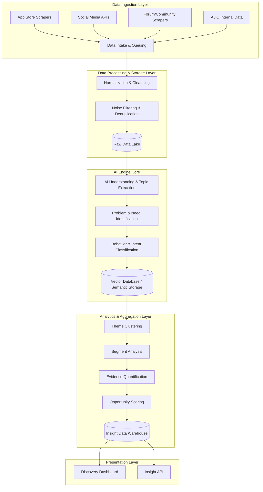

# AI-Powered Discovery Engine: System Architecture

## 1. Overview
The architecture is designed to continuously ingest unstructured user conversations from multiple external sources, process them using AI and Natural Language Processing (NLP) to extract meaningful insights, and present a structured **Problem Landscape** to Product Managers. This system bridges the gap between raw, distributed user feedback and actionable product opportunities related to wishlist-to-purchase conversion.

## 2. High-Level Architecture Diagram

## 3. System Components

### 3.1. Data Ingestion Layer
**Purpose:** Collect public user feedback and conversations across diverse platforms at scale.
- **Components:** Scheduled jobs and distributed crawlers (e.g., Apache Airflow, Cron Jobs).
- **Sources:** Google Play Store, Apple App Store, Reddit (e.g., r/IndianFashionAddicts), YouTube Comments API, specialized fashion forums, and internal product behavioral data.
- **Mechanism:** Asynchronous event queues (e.g., RabbitMQ, Redis) handle the influx of high-volume data streams safely.

### 3.2. Data Processing & Normalization Layer
**Purpose:** Cleanse and format raw unstructured data into a uniform schema to ensure high-quality AI inputs.
- **Normalization:** Standardizes timestamps, source labels, and text encodings into a universal JSON schema.
- **Noise Filtering:** Employs heuristics and lightweight ML models to identify and discard spam, promotional content, bot-generated text, and duplicates.
- **Anonymization:** Redacts PII (Personally Identifiable Information) to maintain privacy compliance.
- **Storage:** Stores the cleaned, base-level text locally or via free tier cloud storage (e.g., AWS S3 Free Tier, Google Drive API).

### 3.3. AI Engine (The Core Intelligence)
**Purpose:** Transform raw text into structured intent, identifying user problems and unmet needs.
- **LLM/NLP Pipeline:** Uses Groq's high-speed API (free tier) with high-end models like `llama-3.3-70b-versatile` to perform:
  - **Topic Extraction:** Categorizing the discussion (e.g., Size, Fit, Pricing).
  - **Problem Identification:** Extracting the exact user friction (e.g., "Size chart is inaccurate compared to user reviews").
  - **Intent Classification:** Categorizing the user's intent into buckets such as *High Purchase Intent*, *Consideration*, *Comparison*, or *Bookmarking*.
- **Vector Embeddings:** Converts the processed problems into high-dimensional vectors using open-source models (e.g., HuggingFace SentenceTransformers) to enable semantic similarity matching.

### 3.4. Analytics & Aggregation Layer
**Purpose:** Group similar problems, quantify their impact, and compute opportunity scores to guide product decisions.
- **Theme Clustering:** Uses density-based clustering algorithms (e.g., HDBSCAN on vector embeddings) to dynamically discover recurring themes without relying solely on a fixed, rigid taxonomy.
- **Quantification Engine:** Calculates metrics for each cluster: problem prevalence, sentiment intensity, cross-platform recurrence, and segment reach.
- **Opportunity Scoring:** A scoring module that mathematically prioritizes problems. 
  - *Formula:* `Opportunity Score = Prevalence × Intent Relevance × Severity × Evidence Strength × Conversion Proximity`

### 3.5. Presentation Layer
**Purpose:** Deliver actionable, evidence-backed insights to the Product Management team.
- **Discovery Dashboard:** A web-based BI tool or custom React frontend displaying the Problem Landscape.
- **Key Features:** 
  - **Evidence Drill-Down:** Allows PMs to click on an insight and view the original raw quotes that generated it.
  - **Trend Analysis:** Visualizes whether a specific barrier (e.g., fit uncertainty) is increasing over time.
  - **Cross-Platform Comparison:** Highlights problems unique to specific platforms (e.g., Reddit vs. App Reviews).
  - **Segment Filtering:** Filtering by user segments (e.g., New vs. Returning users).

## 4. Key Workflows in Action

### Example: Identifying a Sizing Barrier
1. **Ingest:** The system scrapes a recent Reddit thread discussing AJIO dresses.
2. **Process:** Emojis are cleaned, and duplicate links are removed.
3. **Analyze:** The LLM processes a specific comment: *"I saved this dress on AJIO but didn't buy because sizing reviews were all over the place."*
4. **Identify:** The engine tags the data: 
   - `Problem: Size/Fit Uncertainty`
   - `Intent: High Purchase Intent`
   - `Purchase Stage: Pre-purchase evaluation`
5. **Cluster:** The vector embedding of this comment places it into an existing "Inconsistent Sizing Reviews" cluster.
6. **Quantify:** The engine increments the prevalence and evidence strength scores for this cluster, potentially elevating its overall Opportunity Score on the Product Manager's dashboard.

## 5. Technology Stack Recommendations

| Layer | Recommended Technologies (Free Tier / Open Source) |
| :--- | :--- |
| **Orchestration & Queuing** | Apache Airflow, RabbitMQ, Redis |
| **Data Processing** | Python (Pandas/Dask), Apache Spark (Local/Free Cluster) |
| **AI / LLM Processing** | Groq API (Free Tier - llama-3.3-70b-versatile) |
| **Vector Database** | ChromaDB, Qdrant (Free Tier), pgvector (PostgreSQL) |
| **Data Warehouse** | PostgreSQL (Free Tier hosting like Supabase/Neon) |
| **Frontend / Dashboard** | Next.js, Tailwind CSS, Metabase (Open Source) |
